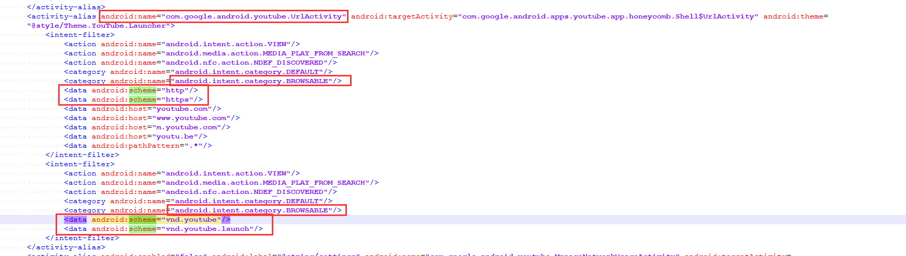

# Intent打开Youtube并带入搜索关键字

想要app内直接打开youtube并带入搜索的关键字，由于网上没有搜到解决方案，故解决后记录一下，也可以给其他人参考。效果如下(直接打开Youtube并搜索VR关键字视频)：


网上能搜到的都是这种写法：
`Intent appIntent = new Intent(Intent.ACTION_VIEW, Uri.parse("vnd.youtube:" + id));`
其中id为频道id，与我的需求不符合，我并不知道频道id，只晓得目标关键字，所以只能继续探索。在youtube的网站上直接搜索关键字"VR"，浏览器的地址为："https://www.youtube.com/results?search_query=vr",所以我改了方式，直接：
`intent = new Intent(Intent.ACTION_VIEW);
intent.setData(Uri.parse("https://www.youtube.com/results?search_query=vr"));`
这种方式呢，在调用时，系统会弹出让用户选择应用，能被选择的应用有浏览器（系统自带及自己安装的）、youtube等其他应用，我这里需要指定应用，故继续摸索。在解压youtube.apk后，查看其主配置文件，会发现如下一段：


So,搞定，Youtube确实有一个UrlActivity可用来解析加载http,https,vnd.youtube等，所以最后写法：
```java
intent = new Intent(Intent.ACTION_VIEW);
intent.setData(Uri.parse("https://www.youtube.com/results?search_query=vr"));
intent.setClassName("com.google.android.youtube","com.google.android.youtube.UrlActivity");
startActivity(intent);
```
**Over**

