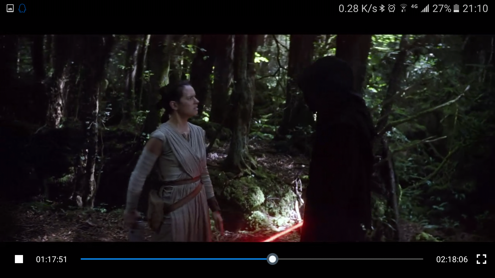
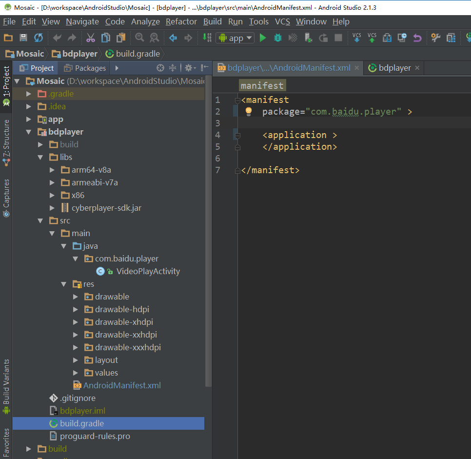
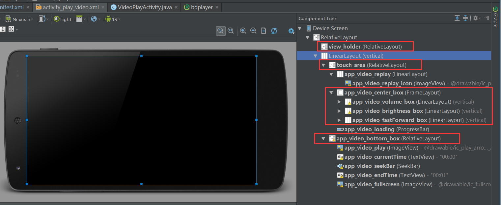
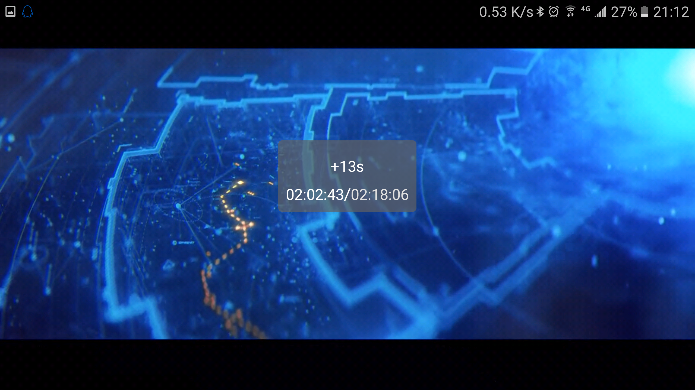
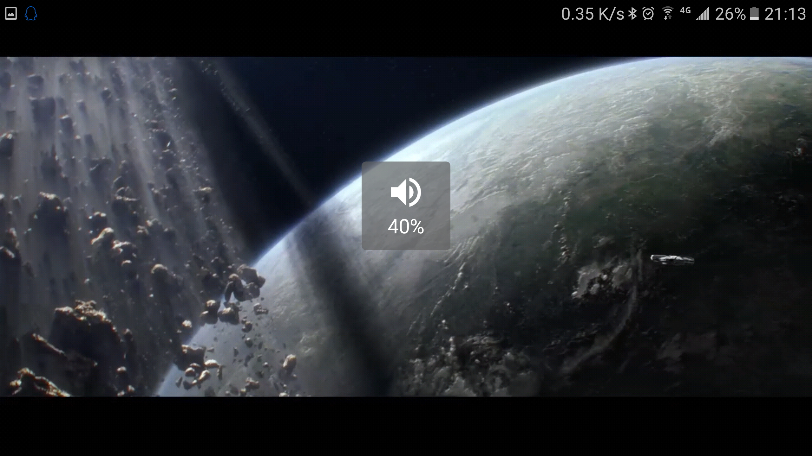
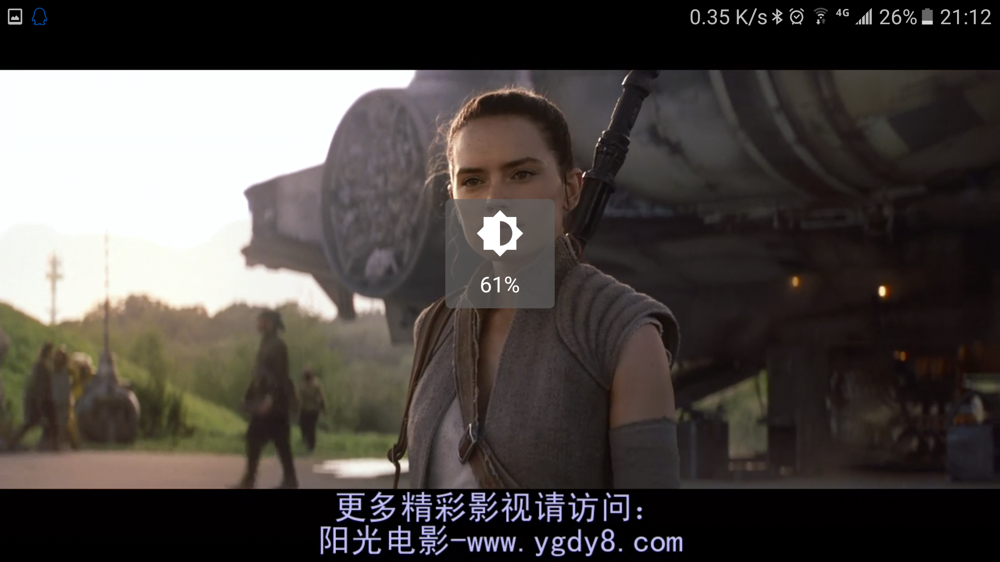
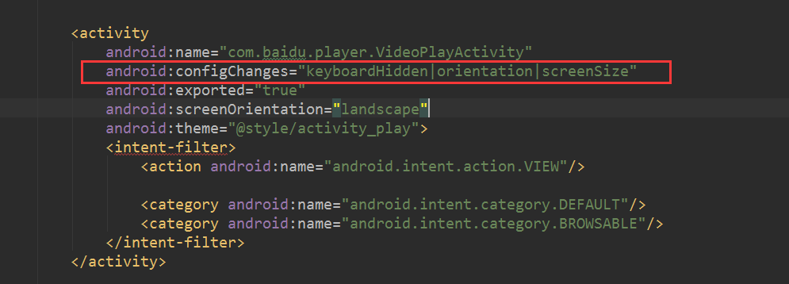

# 基于ijkplayer、百度视频播放器SDK打造简单的应用内播放页面，支持手势，module可直接使用

[完整Module的Github地址](https://github.com/AFAP/Player)

【2017.10.27更新：加入ijkplay的module，.so文件是自己编译的可以支持更多的格式。具体如何调用，看app主界面测试的代码】

　　在开发一些应用时，我们需要实现视频的播放（本地或者网络的），在没有特殊要求的情况下，我们可以利用第三方SDK来实现一个简易的播放页面。这么做的目的，主要就是为了实现使用体验的统一，避免用户手机上已有的播放器各异导致的各种问题。
 　　本文就是介绍如何利用百度的Android播放器SDK来打造一个属于自己的播放器，原则上你可以上网找其他的也行。自定义的功能主要有：1.实现简易的时长、进度显示；2.实现横向划屏来快进、快退；3.左侧屏幕上下划屏来实现亮度控制；4.右侧屏幕上下划屏实现音量控制。



## 1.简单说明

* 使用的库：**[[百度播放器](https://bce.baidu.com/doc/Downloadcenter/player.html#.E6.92.AD.E6.94.BE.E5.99.A8.20Android.20SDK) ](https://cloud.baidu.com/doc/MCT/Android-SDK.html#.E7.89.88.E6.9C.AC.E6.9B.B4.E6.96.B0.E8.AE.B0.E5.BD.95)**、**[IJK播放器](https://github.com/Bilibili/ijkplayer)**

* 使用到的资源，我实在记不得了，当时也是广撒网找了好多个，最后忘记用的哪个的了，本文就是融合总结。
* 我试了很多库，最终才确定用的百度的，主要原因是使用简单，稳定，兼容格式多，还能播放http等网络视频流。我试过的几个库，我也简单说下：
 1.**[vitamio](https://github.com/yixia/VitamioBundle/)**：这个是我一开始用的，且使用了一段时间，特点是集成难度一般，用的人比较多，兼容格式也多，但是当时放弃的一个主要原因是不支持ARM64，而用户有这些手机……
  2.**[sinavideo_playersdk](https://github.com/SinaVDDeveloper/sinavideo_playersdk)**：这个是由原来Sina员工维护的，特点是自带界面比较舒服，缺点是员工已离职，没人维护了，使用会有坑！
  3.**[ExoPlayer](https://github.com/google/ExoPlayer)**：这个是谷歌亲爹出的，然而并不实用，特点是对视频流有很好的支持，引入很方便，缺点是本地视频支持的格式实在太少了，难道国外的视频全部是统一的mp4吗？

## 2.项目结构
如下图所示，集成的播放页面被作为了一个单独的module，这样的好处就是完全独立，在主app内的主配置文件，记得加一下这个Acticity即可，提前说一下，在调用VideoPlayActivity时只需要传递一个参数url，该值可以是文件的全路径或者在线视频地址。
图中还有个注意点，就是bdplayer/libs下的jar和.so，根据自己的需要从下载的SDK中获取添加。



该module只有一个Activity，即播放页面；一个layout，以及若干图片资源文件。在该module的主配置文件`AndroidManifest.xml`中不需要多余设置。

该module的`build.gradle`如下：

```js
apply plugin: 'com.android.library'

android {
	compileSdkVersion 23
	buildToolsVersion "23.0.2"

	defaultConfig {
		minSdkVersion 14
		targetSdkVersion 23
		versionCode 116
		versionName "1.16.0"
	}
	sourceSets.main {
		jni.srcDirs = []
		jniLibs.srcDir 'libs'
	}
}

dependencies {
	compile fileTree(dir: 'libs', include: ['*.jar'])
}
```

## 3. 播放页面布局



从图中可以看出，整个页面主要包含以下几个id的View：
1.view_holder，充满整个屏幕，待添加播放器View；
2.touch_area，除底部进度位置外的全部区域，监听手势；这其中还包含app_video_center_box，该区域位于屏幕中央，用来显示进度、亮度、音量的值；
3.app_video_bottom_box，底部用来显示时长、进度、暂停、全屏的区域。

## 4.实现播放器播放视频
接下来进入Activity的编码部分了，这其中用到的关于播放器的API，详细的可以查看官网的文档。本项目也仅仅是用到了几个比较常用的方法。**完整代码见最后。**
首先，创建播放器BVideoView，并添加至view_holder中，然后对播放器进行一些基础配置设置，包括视频来源、是否显示缓冲信息（针对网络视频），播放器准备完毕事件、播放结束事件、播放出错等等一些监听。

```java
protected void onCreate(Bundle savedInstanceState) {
	super.onCreate(savedInstanceState);
	setContentView(R.layout.activity_play_video);

	mVideoSource = getIntent().getStringExtra("url");

	PowerManager pm = (PowerManager) getSystemService(Context.POWER_SERVICE);
	mWakeLock = pm.newWakeLock(PowerManager.FULL_WAKE_LOCK | PowerManager.ON_AFTER_RELEASE, TAG);

	audioManager = (AudioManager) getSystemService(Context.AUDIO_SERVICE);
	mMaxVolume = audioManager.getStreamMaxVolume(AudioManager.STREAM_MUSIC);

	mViewHolder = (RelativeLayout) findViewById(R.id.view_holder);

	BVideoView.setAK("xxxxxxxxxxxxxxxxxxxxxxx");
	mVV = new BVideoView(this);
	mViewHolder.addView(mVV);

	mVV.setOnPreparedListener(this);
	mVV.setOnCompletionListener(this);
	mVV.setOnCompletionWithParamListener(this);
	mVV.setOnErrorListener(this);
	mVV.setOnInfoListener(this);
	mVV.setOnPlayingBufferCacheListener(this);

	mVV.setDecodeMode(BVideoView.DECODE_SW);
	mVV.showCacheInfo(true);
	mVV.setVideoPath(mVideoSource);

	$ = new Query(this);
	seekBar = (SeekBar) findViewById(R.id.app_video_seekBar);
	seekBar.setOnSeekBarChangeListener(mSeekListener);

	$.id(R.id.app_video_play).clicked(onClickListener);
	$.id(R.id.app_video_fullscreen).clicked(onClickListener);
	$.id(R.id.app_video_replay_icon).clicked(onClickListener);

	portrait = getScreenOrientation() == ActivityInfo.SCREEN_ORIENTATION_PORTRAIT;

	screenWidthPixels = getResources().getDisplayMetrics().widthPixels;

	onPrepared();
}

public void onPrepared() {
	duration = mVV.getDuration();

	final GestureDetector gestureDetector = new GestureDetector(this, new PlayerGestureListener());
	mRoot = findViewById(R.id.touch_area);
	mRoot.setClickable(true);
	mRoot.setOnTouchListener(new View.OnTouchListener() {
		@Override
		public boolean onTouch(View view, MotionEvent motionEvent) {
			if (gestureDetector.onTouchEvent(motionEvent))
				return true;

			// 处理手势结束
			switch (motionEvent.getAction() & MotionEvent.ACTION_MASK) {
				case MotionEvent.ACTION_UP:
					endGesture();
					break;
			}

			return false;
		}
	});

	mVV.start();
}
```

通过以上代码，就可以实现视频的播放了（先不要看触摸事件监听等等啦，通过核心的几行设置，就能看视频了）。Activity需要实现OnPreparedListener, OnCompletionListener, OnErrorListener, OnInfoListener, OnPlayingBufferCacheListener,  OnCompletionWithParamListener对应的方法，各个方法的功能，根据方法名称应该就能知道的差不多了。

## 5.实现底部时长、进度、暂停/播放的显示与控制


如上图所示，播放时，影片的底部会显示暂停/播放按钮、当前时长、总时长、进度条以及全屏按钮。
* 1.捕获屏幕点击事件，对底部区域进行显隐操作（默认不点击屏幕是不显示底部的）
获取touch_area并设置触摸屏幕监听事件：setOnTouchListener.


```java
final GestureDetector gestureDetector = new GestureDetector(this, new PlayerGestureListener());
mRoot = findViewById(R.id.touch_area);
mRoot.setClickable(true);
mRoot.setOnTouchListener(new View.OnTouchListener() {
	@Override
	public boolean onTouch(View view, MotionEvent motionEvent) {
		if (gestureDetector.onTouchEvent(motionEvent))
			return true;

		// 处理手势结束
		switch (motionEvent.getAction() & MotionEvent.ACTION_MASK) {
			case MotionEvent.ACTION_UP:
				endGesture();
				break;
		}

		return false;
	}
});

public class PlayerGestureListener extends GestureDetector.SimpleOnGestureListener {
	private boolean firstTouch;
	private boolean volumeControl;
	private boolean toSeek;

	/**
	 * 双击
	 */
	@Override
	public boolean onDoubleTap(MotionEvent e) {
//            videoView.toggleAspectRatio();
		return true;
	}

	@Override
	public boolean onDown(MotionEvent e) {
		firstTouch = true;
		return super.onDown(e);

	}

	/**
	 * 滑动
	 */
	@Override
	public boolean onScroll(MotionEvent e1, MotionEvent e2, float distanceX, float distanceY) {
		float mOldX = e1.getX(), mOldY = e1.getY();
		float deltaY = mOldY - e2.getY();
		float deltaX = mOldX - e2.getX();
		if (firstTouch) {
			toSeek = Math.abs(distanceX) >= Math.abs(distanceY);
			volumeControl = mOldX > screenWidthPixels * 0.5f;
			firstTouch = false;
		}

		if (toSeek) {
			if (!isLive) {
				onProgressSlide(-deltaX / mRoot.getWidth());
			}
		} else {
			float percent = deltaY / mRoot.getHeight();
			if (volumeControl) {
				onVolumeSlide(percent);
			} else {
				onBrightnessSlide(percent);
			}
		}
		return super.onScroll(e1, e2, distanceX, distanceY);
	}

	@Override
	public boolean onSingleTapUp(MotionEvent e) {
		if (isShowing) {
			hide(false);
		} else {
			show(defaultTimeout);
		}
		return true;
	}
}

public void show(int timeout) {
	if (!isShowing) {
		if (!isLive) {
			showBottomControl(true);
		}
		if (!fullScreenOnly) {
			$.id(R.id.app_video_fullscreen).visible();
		}
		isShowing = true;
	}
	updatePausePlay();
	handler.sendEmptyMessage(MESSAGE_SHOW_PROGRESS);
	handler.removeMessages(MESSAGE_FADE_OUT);
	if (timeout != 0) {
		handler.sendMessageDelayed(handler.obtainMessage(MESSAGE_FADE_OUT), timeout);
	}
}

private void showBottomControl(boolean show) {
	$.id(R.id.app_video_play).visibility(show ? View.VISIBLE : View.GONE);
	$.id(R.id.app_video_currentTime).visibility(show ? View.VISIBLE : View.GONE);
	$.id(R.id.app_video_endTime).visibility(show ? View.VISIBLE : View.GONE);
	$.id(R.id.app_video_seekBar).visibility(show ? View.VISIBLE : View.GONE);
}
```

这里先不看滑动，就看点击屏幕后的动作，执行的是show(defaultTimeout)，在这个方法里执行了显示操作，并通过handler来实现达到一定时间后隐藏控件。其中$是自定义一个类，用来实现findViewById和setText等功能的。
BVideoView.setAK，这里需要去百度申请下key。

- 2.获取影片总时长、当前播放时点，并格式化展示：


	private int setProgress() {
		if (isDragging) {
			return 0;
		}
	
		int position = mVV.getCurrentPosition();
		int duration = mVV.getDuration();
		if (seekBar != null) {
			if (duration > 0) {
				seekBar.setProgress((position * 100 / duration));
			}
		}
	
		this.duration = duration;
	
		$.id(R.id.app_video_currentTime).text(generateTime(position));
		$.id(R.id.app_video_endTime).text(generateTime(this.duration));
		return position;
	}
	
	private String generateTime(int time) {
		int totalSeconds = time;
		int seconds = totalSeconds % 60;
		int minutes = (totalSeconds / 60) % 60;
		int hours = totalSeconds / 3600;
		return hours > 0 ? String.format("%02d:%02d:%02d", hours, minutes, seconds) : String.format("%02d:%02d",
				minutes, seconds);
	}
这一步就比较简单了，通过播放器API获取影片的总时长和当前正在播放的时长，通过格式化方法，将值设置到对应的控件上。

- 3.暂停/播放按钮功能的实现


```java
private void doPauseResume() {
	if (status == STATUS_COMPLETED) {
		$.id(R.id.app_video_replay).gone();
		mVV.seekTo(0);
		mVV.start();
	} else if (mVV.isPlaying()) {
		statusChange(STATUS_PAUSE);
		mVV.pause();
	} else {
		mVV.start();
	}
	updatePausePlay();
}

private void updatePausePlay() {
	if (mVV.isPlaying()) {
		$.id(R.id.app_video_play).image(R.drawable.ic_stop_white_24dp);
	} else {
		$.id(R.id.app_video_play).image(R.drawable.ic_play_arrow_white_24dp);
	}
}
```
设置app_video_play控件的点击事件为doPauseResume(),该方法中会获取当前播放状态，如在播放则暂停，如已暂停，则开始播放。注意，在调用相关方法后，记得设置按钮对应状态的图片。

- 4.实现底部进度条的滑动控制事件


```java
private final SeekBar.OnSeekBarChangeListener mSeekListener = new SeekBar.OnSeekBarChangeListener() {
	@Override
	public void onProgressChanged(SeekBar seekBar, int progress, boolean fromUser) {
		if (!fromUser)
			return;
		int newPosition = (int) ((duration * progress * 1.0) / 100);
		String time = generateTime(newPosition);
		if (instantSeeking) {
			mVV.seekTo(newPosition);
		}
		$.id(R.id.app_video_currentTime).text(time);
	}

	@Override
	public void onStartTrackingTouch(SeekBar seekBar) {
		isDragging = true;
		show(3600000);
		handler.removeMessages(MESSAGE_SHOW_PROGRESS);
		if (instantSeeking) {
			audioManager.setStreamMute(AudioManager.STREAM_MUSIC, true);
		}
	}

	@Override
	public void onStopTrackingTouch(SeekBar seekBar) {
		if (!instantSeeking) {
			mVV.seekTo((int) ((duration * seekBar.getProgress() * 1.0) / 100));
		}
		show(defaultTimeout);
		handler.removeMessages(MESSAGE_SHOW_PROGRESS);
		audioManager.setStreamMute(AudioManager.STREAM_MUSIC, false);
		isDragging = false;
		handler.sendEmptyMessageDelayed(MESSAGE_SHOW_PROGRESS, 1000);
	}
};
```
这个就是根据当前seekbar的定位，来计算进度百分比，然后计算得到对应的影片时长，再调用播放器设置到对应的时点。此处需要注意的是onProgressChanged方法中，需要判断该变化来自用户手动操作还是系统方法，只有用户主动操作的，才需要后续动作。

## 6.手势操作
在这里，我们首先要捕获手势，并根据X/Y方向的位移来区分出用户的操作：左右划屏、上下划屏，同时上下划屏时还要判断出是在屏幕左侧还是右侧。

这里我们主要看下手势事件里的onScroll方法的实现：


```java
@Override
public boolean onScroll(MotionEvent e1, MotionEvent e2, float distanceX, float distanceY) {
	float mOldX = e1.getX(), mOldY = e1.getY();
	float deltaY = mOldY - e2.getY();
	float deltaX = mOldX - e2.getX();
	if (firstTouch) {
		toSeek = Math.abs(distanceX) >= Math.abs(distanceY);
		volumeControl = mOldX > screenWidthPixels * 0.5f;
		firstTouch = false;
	}

	if (toSeek) {
		if (!isLive) {
			onProgressSlide(-deltaX / mRoot.getWidth());
		}
	} else {
		float percent = deltaY / mRoot.getHeight();
		if (volumeControl) {
			onVolumeSlide(percent);
		} else {
			onBrightnessSlide(percent);
		}
	}
	return super.onScroll(e1, e2, distanceX, distanceY);
}
```
代码不难理解，首先计算在X和Y方向的绝对位移，若X大，则表示是横向的手势，对应操作是快退和快进；若Y大，则表示是纵向手势，此时需要判断x的起点是否比屏幕宽度的一半大，如大于半个屏幕，则是在右侧的操作，对应声音调节，如小于半个屏幕，则是左侧操作，对应亮度调节。

- 1.左/右划屏实现快退/快进



识别出手势后，接下来就简单了：


```java
private void onProgressSlide(float percent) {
	int position = mVV.getCurrentPosition();
	int duration = mVV.getDuration();
	int deltaMax = Math.min(200, duration - position);
	int delta = (int) (deltaMax * percent);

	newPosition = delta + position;
	if (newPosition > duration) {
		newPosition = duration;
	} else if (newPosition <= 0) {
		newPosition = 0;
		delta = -position;
	}
	int showDelta = delta;
	if (showDelta != 0) {
		$.id(R.id.app_video_fastForward_box).visible();
		String text = showDelta > 0 ? ("+" + showDelta) : "" + showDelta;
		$.id(R.id.app_video_fastForward).text(text + "s");
		$.id(R.id.app_video_fastForward_target).text(generateTime(newPosition) + "/");
		$.id(R.id.app_video_fastForward_all).text(generateTime(duration));
	}
}
```
在计算出快退和快进的步长后，还需要在屏幕中间显示告知用户目标步长等信息。

- 2.亮度调节



```java
/**
 * 滑动改变亮度
 */
private void onBrightnessSlide(float percent) {
	if (brightness < 0) {
		brightness = getWindow().getAttributes().screenBrightness;
		if (brightness <= 0.00f) {
			brightness = 0.50f;
		} else if (brightness < 0.01f) {
			brightness = 0.01f;
		}
	}
	$.id(R.id.app_video_brightness_box).visible();
	WindowManager.LayoutParams lpa = getWindow().getAttributes();
	lpa.screenBrightness = brightness + percent;
	if (lpa.screenBrightness > 1.0f) {
		lpa.screenBrightness = 1.0f;
	} else if (lpa.screenBrightness < 0.01f) {
		lpa.screenBrightness = 0.01f;
	}
	$.id(R.id.app_video_brightness).text(((int) (lpa.screenBrightness * 100)) + "%");
	getWindow().setAttributes(lpa);

}
```
根据位移百分比计算亮度，最后设置。

- 3.音量调节



```java
/**
 * 滑动改变声音大小
 */
private void onVolumeSlide(float percent) {
	if (volume == -1) {
		volume = audioManager.getStreamVolume(AudioManager.STREAM_MUSIC);
		if (volume < 0)
			volume = 0;
	}
	hide(true);

	int index = (int) (percent * mMaxVolume) + volume;
	if (index > mMaxVolume)
		index = mMaxVolume;
	else if (index < 0)
		index = 0;

	// 变更声音
	audioManager.setStreamVolume(AudioManager.STREAM_MUSIC, index, 0);

	// 变更进度条
	int i = (int) (index * 1.0 / mMaxVolume * 100);
	String s = i + "%";
	if (i == 0) {
		s = "";
	}
	// 显示
	$.id(R.id.app_video_volume_icon).image(i == 0 ? R.drawable.ic_volume_off_white_36dp : R.drawable
			.ic_volume_up_white_36dp);
	$.id(R.id.app_video_brightness_box).gone();
	$.id(R.id.app_video_volume_box).visible();
	$.id(R.id.app_video_volume_box).visible();
	$.id(R.id.app_video_volume).text(s).visible();
}
```
同理，根据位移百分比来设置音量。

## 7.如何使用

首先如图，在app中猪配置文件加入该Activity：





然后，传入视频来源参数，并打开播放页：

```java
Intent intent = new Intent(TutorialActivity.this, VideoPlayActivity.class);
intent.putExtra("url", url);
startActivity(intent);
```
**url可以是本地文件全路径，也可以是网络地址。记得在settings.gradle中引入module*
