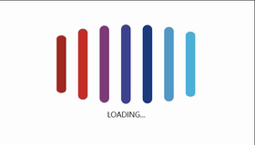

# CSS实现的Loading样式



```html

<!DOCTYPE html>
<html lang="en">

<head>
    <meta charset="UTF-8">
    <meta name="viewport" bigboxtent="width=device-width, initial-scale=1.0">
    <meta http-equiv="X-UA-Compatible" bigboxtent="ie=edge">
    <title>Document</title>
    <style>
        body {
            background-color: #333;
        }

        .bigbox {
            width: 380px;
            height: 270px;
            margin: 150px auto 0;
        }

        .bigbox div {
            height: 200px;
            width: 24px;
            margin: 15px;
            float: left;
            background: #ddd;
            border-radius: 12px;
        }

        .bigbox p {
            text-align: center;
            font-size: 18px;
            color: #fff;
        }

        .bigbox .box:nth-child(1) {
            background-color: #a12a22;
            animation: mymove 500ms ease -600ms infinite alternate;
        }

        .bigbox .box:nth-child(2) {
            background-color: #c52e27;
            animation: mymove 500ms ease -500ms infinite alternate;
        }

        .bigbox .box:nth-child(3) {
            background-color: #7d3b79;
            animation: mymove 500ms ease -400ms infinite alternate;
        }

        .bigbox .box:nth-child(4) {
            background-color: #3e428b;
            animation: mymove 500ms ease -300ms infinite alternate;
        }

        .bigbox .box:nth-child(5) {
            background-color: #1e3a7b;
            animation: mymove 500ms ease -200ms infinite alternate;
        }

        .bigbox .box:nth-child(6) {
            background-color: #5598c3;
            animation: mymove 500ms ease -100ms infinite alternate;
        }

        .bigbox .box:nth-child(7) {
            background-color: #4eb1d8;
            animation: mymove 500ms ease 000ms infinite alternate;
        }

        @keyframes mymove {
            /* 2d缩放 */
            from {
                transform: scale(1, 0.3);
            }

            to {
                transform: scale(1, 1);
            }
        }
    </style>
</head>


<body>
    <div class="bigbox">
        <div class="box"></div>
        <div class="box"></div>
        <div class="box"></div>
        <div class="box"></div>
        <div class="box"></div>
        <div class="box"></div>
        <div class="box"></div>
        <p>LOADING...</p>
    </div>
</body>

</html>

```