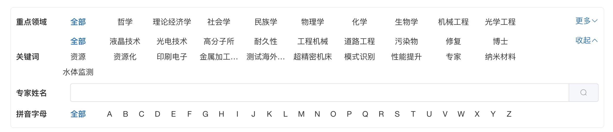

# 选项菜单自动换行的简单实现（Vue）

在做列表筛选的时候经常会按照不同的维度来过滤筛选数据，多标签可供选择就比较常见，但是标签较多时，就涉及到选项标签的展开与折叠，这与展示区域、选项个数有关系，下面的实现就是解决了页面宽度不确定、标签个数不确定、标签宽度不确定时的自动折叠。



## 实现思路：
* 选项展示区采用flex布局，允许换行；
* 选项高度固定，默认状态下，选强展示区的高度就是单个选项的高度；
* 采用展示区域的max-height来控制展开、收起状态；
* 监听到选项数组变化、浏览器窗口大小变化时，重新判断是否需要展示“更多”
* 采用子选项的长度总和与选项展示区域宽度比较的方式确定选项是否换行，是否要显示“更多”

主要特点：
* 不需要考虑选项的个数，即展开、收起操作时，选项数组不会变化，不需要干预；
* 采用CSS实现样式的控制，选项宽度无限制，按需修改样式可实现等宽、不等宽的需求；
* 可实时按照浏览器窗口大小来调整布局，并按需展示“更多”；
* 不同的需求，包括PC、手机的不同要求，可用css来调整。


主要实现如下（示例代码是作为一个可复用组件方式实现的）： 
```vue
<template>
  <div class="searchbar-container">
    <span class="condition-title">{{ title }}</span>

    <div ref="search-option-container" :class="['search-option-container', isExpand ? 'search-option-container-expand' : '']">

      <div class="condition-option-frame">
        <span :class="['condition-option', value == '' ? 'condition-option-selected' : '']" @click="handleSelect('')">全部</span>
      </div>

      
        <div class="condition-option-frame" v-for="(op, index) in options" :key="index" :content="op"  @click="handleSelect(`${op}`)">
          <span :class="[`${optionClassName}`, 'condition-option', (optionValueKey ? op[optionValueKey] : op) === value ? 'condition-option-selected' : '' ]">{{ optionlabelKey ? op[optionlabelKey] : op }}</span>
        </div>

    </div>

    <div class="condition-option-more">
      <div v-if="showToggle" @click="handleMore">
        {{ isExpand ? '收起' : '更多'}}<i :class="[isExpand ? 'el-icon-arrow-up' : 'el-icon-arrow-down']"></i>
      </div>
    </div>
  </div>
</template>
<script>

export default {
  name: 'SearchOptionsAutoFold',
  props: {
    title: {
      type: String,
      default: '工业大类'
    },
    prop: {
      type: String,
      default: ''
    },
    value: {
      type: String,
      default: ''
    },
    optionClassName: {
      type: String,
      default: ''
    },
    options: {
      type: Array,
      default: function () {
        return ["煤炭开采和洗选业", "石油和天然气开采业", "黑色金属矿采选业", "有色金属矿采选业", "非金属矿采选业", "其他采矿业", "农副食品加工业", "食品制造业", "饮料制造业", "烟草制品业", "纺织业", "纺织服装、鞋、帽制造业", "皮革、毛皮、羽毛(绒)及其制品业", "木材加工及木、竹、藤、棕、草制品业", "家具制造业", "造纸及纸制品业", "印刷业和记录媒介的复制", "文教体育用品制造业", "石油加工、炼焦及核燃料加工业", "化学原料及化学制品制造业", "医药制造业", "化学纤维制造业", "橡胶制品业", "塑料制品业", "非金属矿物制品业", "黑色金属冶炼及压延加工业", "有色金属冶炼及压延加工业", "金属制品业", "通用设备制造业", "专用设备制造业", "交通运输设备制造业", "电气机械及器材制造业", "通信设备、计算机及其他电子设备制造业", "仪器仪表及文化、办公用机械制造业", "工艺品及其他制造业", "废弃资源和废旧材料回收加工业", "电力、热力的生产和供应业", "燃气生产和供应业", "水的生产和供应业"];
      }
    },
    optionlabelKey: {
      type: String,
      default: ''
    },
    optionValueKey: {
      type: String,
      default: ''
    },
  },
  data() {
    return {
      showToggle: false,
      isExpand: false
    }
  },
  watch: {
    options(val, oldVal) {
      if (val.length > 0) {
        this.refreshViews();
      }
    }
  },
  mounted() {
    if (this.options.length > 0) {
      this.refreshViews();
    }
    window.onresize = () => {
      this.refreshViews();
    }
  },
  methods: {
    handleMore() {
      this.isExpand = !this.isExpand
    },
    handleSelect(value) {
      this.$emit('handleSelect', this.prop, value)
    },
    refreshViews() {
      this.$nextTick(() => { // 页面渲染完成后的回调

        let containerClientWidth = this.$refs['search-option-container'].clientWidth;
        let length = this.$refs['search-option-container'].children.length;

        console.log('containerClientWidth==>' + containerClientWidth)
        console.log('length==>' + length)
        let totalWidth = 0;
        for (let i = 0; i < length; i++) {
          totalWidth = totalWidth + this.$refs['search-option-container'].children[i].clientWidth
        }
        // 存在更多选项
        this.showToggle = totalWidth > containerClientWidth;
      })
    }
  }
}
</script>
<style scoped>
.searchbar-container {
  padding: 4px 0px;
  display: flex;
  align-items: center;
}
.condition-title {
  font-weight: bold;
  width: 5em;
  flex-shrink: 0;
}
.search-item-container {
  flex-grow: 1;
  display: flex;
  flex-wrap: wrap;
}

.search-option-container {
  flex-grow: 1;
  display: flex;
  flex-wrap: wrap;
  max-height: 30px;
  overflow: hidden;
}

.search-option-container-expand {
  max-height: 500px;
}

.condition-option-frame {
  padding: 0px 8px;
  margin: 0px;
  height: 30px;
  display: flex;
  align-items: center;
}

.condition-option {
  /* 是否需要等长 */
  width: 5em;
  display: -webkit-box !important;
  overflow: hidden;
  text-overflow: ellipsis;
  word-break: break-all;
  -webkit-box-orient: vertical;
  -webkit-line-clamp: 1;
  text-align: center;
  cursor: pointer;
}
/* 单个字母 */
.condition-option-letter {
  width: 1em;
}

.condition-option-selected {
  color: var(--color-primary);
  font-weight: bold;
}

.condition-option-more {
  padding-top: 5px;
  width: 66px;
  align-self: baseline;
  flex-shrink: 0;
  color: var(--color-primary);
}
.condition-option-more > div {
  display: flex;
  justify-content: flex-end;
  align-items: center;
}

/* 窄屏设备 */
@media only screen and (max-width: 992px) {
}
</style>

```