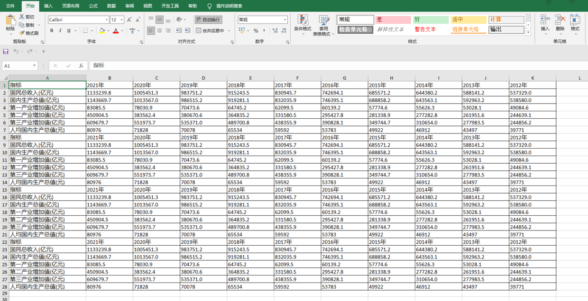

JS实现Excel导出常用的库是[sheetjs](https://sheetjs.com/)，如下：


但是这个库基础版本无法实现带样式导出，可以使用基于sheetjs扩展的开源项目[xlsx-js-style](https://github.com/gitbrent/xlsx-js-style)实现，如下：


在导出文件的使用上与sheetjs无异，数据数组和数据表的生成都是沿用SheetJs的核心API，在导出文件前可以对数据表worksheet进行单元格级别的设置，以下提供一个简单的使用示例，具体可设置的样式可点击上线的xlsx-js-style官网查看。


全局引入，`main.js`加入如下代码：
```js
import XLSX from 'xlsx-js-style'
Vue.prototype.$xlsx = XLSX
```
这样后面就可以直接`this.$xlsx`使用

示例文件
```js
<template>
  <div>
    <input type="button" value="点击生成excel" @click="test">
  </div>
</template>

<script>
export default {
  data() {
    return {};
  },
  methods: {
    test() {
      // excel的表数据，根据实际情况生成
      let excelData = [["指标", "2021年", "2020年", "2019年", "2018年", "2017年", "2016年", "2015年", "2014年", "2013年", "2012年"], ["国民总收入(亿元)", "1133239.8", "1005451.3", "983751.2", "915243.5", "830945.7", "742694.1", "685571.2", "644380.2", "588141.2", "537329.0"], ["国内生产总值(亿元)", "1143669.7", "1013567.0", "986515.2", "919281.1", "832035.9", "746395.1", "688858.2", "643563.1", "592963.2", "538580.0"], ["第一产业增加值(亿元)", "83085.5", "78030.9", "70473.6", "64745.2", "62099.5", "60139.2", "57774.6", "55626.3", "53028.1", "49084.6"], ["第二产业增加值(亿元)", "450904.5", "383562.4", "380670.6", "364835.2", "331580.5", "295427.8", "281338.9", "277282.8", "261951.6", "244639.1"], ["第三产业增加值(亿元)", "609679.7", "551973.7", "535371.0", "489700.8", "438355.9", "390828.1", "349744.7", "310654.0", "277983.5", "244856.2"], ["人均国内生产总值(元)", "80976", "71828", "70078", "65534", "59592", "53783", "49922", "46912", "43497", "39771"], ["指标", "2021年", "2020年", "2019年", "2018年", "2017年", "2016年", "2015年", "2014年", "2013年", "2012年"], ["国民总收入(亿元)", "1133239.8", "1005451.3", "983751.2", "915243.5", "830945.7", "742694.1", "685571.2", "644380.2", "588141.2", "537329.0"], ["国内生产总值(亿元)", "1143669.7", "1013567.0", "986515.2", "919281.1", "832035.9", "746395.1", "688858.2", "643563.1", "592963.2", "538580.0"], ["第一产业增加值(亿元)", "83085.5", "78030.9", "70473.6", "64745.2", "62099.5", "60139.2", "57774.6", "55626.3", "53028.1", "49084.6"], ["第二产业增加值(亿元)", "450904.5", "383562.4", "380670.6", "364835.2", "331580.5", "295427.8", "281338.9", "277282.8", "261951.6", "244639.1"], ["第三产业增加值(亿元)", "609679.7", "551973.7", "535371.0", "489700.8", "438355.9", "390828.1", "349744.7", "310654.0", "277983.5", "244856.2"], ["人均国内生产总值(元)", "80976", "71828", "70078", "65534", "59592", "53783", "49922", "46912", "43497", "39771"], ["指标", "2021年", "2020年", "2019年", "2018年", "2017年", "2016年", "2015年", "2014年", "2013年", "2012年"], ["国民总收入(亿元)", "1133239.8", "1005451.3", "983751.2", "915243.5", "830945.7", "742694.1", "685571.2", "644380.2", "588141.2", "537329.0"], ["国内生产总值(亿元)", "1143669.7", "1013567.0", "986515.2", "919281.1", "832035.9", "746395.1", "688858.2", "643563.1", "592963.2", "538580.0"], ["第一产业增加值(亿元)", "83085.5", "78030.9", "70473.6", "64745.2", "62099.5", "60139.2", "57774.6", "55626.3", "53028.1", "49084.6"], ["第二产业增加值(亿元)", "450904.5", "383562.4", "380670.6", "364835.2", "331580.5", "295427.8", "281338.9", "277282.8", "261951.6", "244639.1"], ["第三产业增加值(亿元)", "609679.7", "551973.7", "535371.0", "489700.8", "438355.9", "390828.1", "349744.7", "310654.0", "277983.5", "244856.2"], ["人均国内生产总值(元)", "80976", "71828", "70078", "65534", "59592", "53783", "49922", "46912", "43497", "39771"], ["指标", "2021年", "2020年", "2019年", "2018年", "2017年", "2016年", "2015年", "2014年", "2013年", "2012年"], ["国民总收入(亿元)", "1133239.8", "1005451.3", "983751.2", "915243.5", "830945.7", "742694.1", "685571.2", "644380.2", "588141.2", "537329.0"], ["国内生产总值(亿元)", "1143669.7", "1013567.0", "986515.2", "919281.1", "832035.9", "746395.1", "688858.2", "643563.1", "592963.2", "538580.0"], ["第一产业增加值(亿元)", "83085.5", "78030.9", "70473.6", "64745.2", "62099.5", "60139.2", "57774.6", "55626.3", "53028.1", "49084.6"], ["第二产业增加值(亿元)", "450904.5", "383562.4", "380670.6", "364835.2", "331580.5", "295427.8", "281338.9", "277282.8", "261951.6", "244639.1"], ["第三产业增加值(亿元)", "609679.7", "551973.7", "535371.0", "489700.8", "438355.9", "390828.1", "349744.7", "310654.0", "277983.5", "244856.2"], ["人均国内生产总值(元)", "80976", "71828", "70078", "65534", "59592", "53783", "49922", "46912", "43497", "39771"]]; // excel表数据

      let workbook = this.$xlsx.utils.book_new(); // 工作簿
      let worksheet = this.$xlsx.utils.aoa_to_sheet(excelData); // 数据表

      let cols = []; // 设置每列的宽度
      // wpx 字段表示以像素为单位，wch 字段表示以字符为单位
      for (let i = 0; i <= excelData[0].length; i++) {
        let col = {};
        if (i == 0) {
          col.wch = 30;
        } else {
          col.wch = 18;
        }
        cols.push(col)
      }
      worksheet['!cols'] = cols; // 设置列宽信息到工作表

      //以下是样式设置，样式设置放在组织完数据之后，xlsx-js-style的核心API就是SheetJS的
      Object.keys(worksheet).forEach(key => {
        // 非!开头的属性都是单元格
        if (!key.startsWith("!")) {
          worksheet[key].s = {
            font: {
              sz: "12"
            },
            alignment: {
              horizontal: "left",
              vertical: "center",
              wrapText: true
            },
            border: {
              top: { style: 'thin' },
              right: { style: 'thin' },
              bottom: { style: 'thin' },
              left: { style: 'thin' }
            }
          };
        }
      })
      this.$xlsx.utils.book_append_sheet(workbook, worksheet, "Sheet1");
      this.$xlsx.writeFile(workbook, "国内生产总值.xlsx");
    },
  },
};
</script>
```
导出效果：
