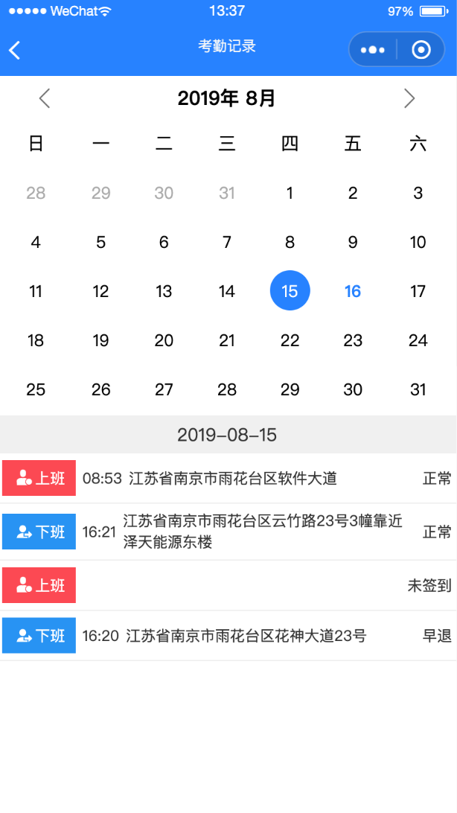
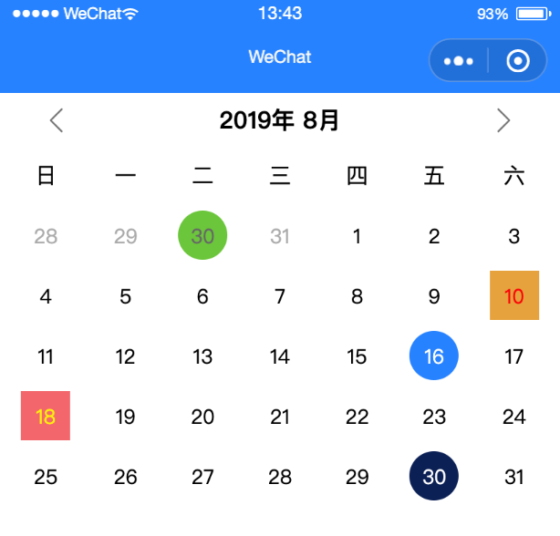
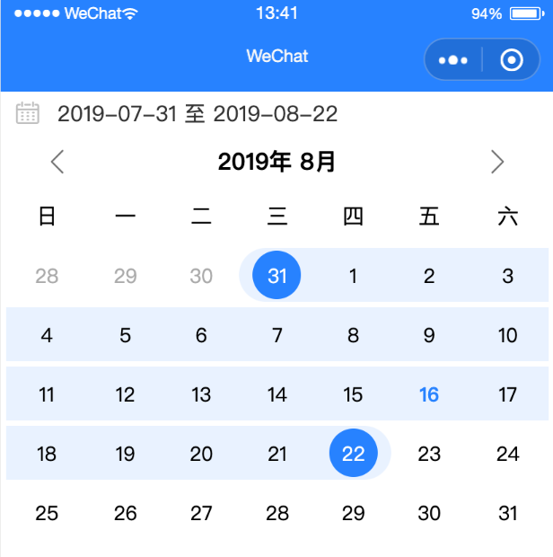

# 小程序插件-日历

[小程序组件github地址](https://github.com/AFAP/XCX-Plugins)

## 使用方法：

## 1.声明组件
下载代码，将components文件夹拷贝至项目根目录（与app.json平级），在`app.json`中声明需要使用的插件，这里的声明是全局的，pages下的页面都能直接用，也可以在某一个page对应的json文件中单独声明。

```
{
  "pages": [
    "pages/demo/calendar"
  ],
  "window": {
    "backgroundTextStyle": "light",
    "navigationBarBackgroundColor": "#fff",
    "navigationBarTitleText": "WeChat",
    "navigationBarTextStyle": "black"
  },
  "usingComponents": {
    "calendar": "/components/calendar/index"
  },
  "sitemapLocation": "sitemap.json"
}
```
 *组件的名字可以自定义，如calendar可以改成calendar666，页面内使用时保持一致即可。

## 2.使用组件
最简单的方式：
```
<calendar />
```
带有一些默认设置的方式
```
<calendar bindOnDayClick="onDayClick" days-style='{{daysStyle}}' />
```
## 3.可设置属性

属性名称 |类型| 默认值 | 说明  
:-: | :-: | :-: | :- 
mode | String | normal | 模式：<br/>normal:常规；<br/>picker: 下拉选取日期<br/>pickerRange: 下拉选择区间
placeholder | String | 无|提示语
title | String | xxx年x月 | 日历标题,如设定值，在月份切换时需要自己设置title值
weekdays | Array | ['日', '一', '二', '三', '四1', '五', '六'] | 如自定义，数组长度需为7
language | String | ZH | 语言：<br/>ZH：中文<br/>EN：英语，不同语言，年月和星期显示不同
selectedMode | String | round | 被选中日期背景模式：<br/>round：圆形<br/>square方形
showMoreMonths | Boolean | true | 是否显示上下月份
showMoreDays | Boolean | true | 是否显示非本月日期
year | Number | 当前年份 | 年份
month | Number | 当前月份 | 月份，注意：此处值从1开始，1-12
selectedDate | String | 当天 | 被选中日期，格式yyyy-MM-DD
daysStyle | Array | 无 | 指定日期样式数组，如：[{id: '2019-07-30',style: 'color: red;'}]会改变2019-07-30的日期颜色，此处是style，可以自由设置属性，会改变整个单元格样式
dotDays | Array | 无 | 指定日期显示标记点，如：[ '2019-10-30']
dotColor | String | red | 点颜色
daysDesc | Array | 无 | 指定日期描述，如：[{id:"2021-08-22",desc:"订满",style:'color: #aaa; '},{id:"2021-08-23",desc:"可订",style:'color: blue; '}]
disableDays | Array | 无 | 禁止点击的日期，如：[ '2021-08-20']

## 4.监听事件

事件名称 | 说明  
:-: | :- 
bindOnDayClick | 点击某一天时触发：<br/>event.detail为被点击日期的Date对象
bindOnRangeComplete | 范围选择完毕时触发：<br/>event.detail为{begin:dateObj,end:dateObj}
bindOnMonthChange | 切换月份时触发：<br/>event.detail为当前月份第一天的Date对象


**示例图片：**

常规模式使用示例：




自定义日期样式：




日期范围选择：



