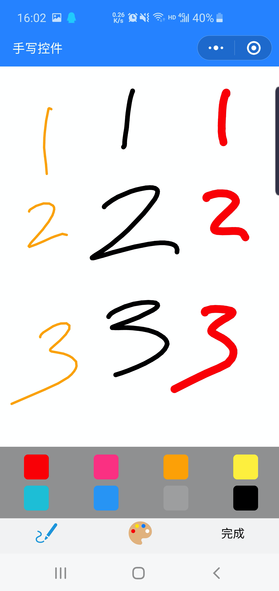
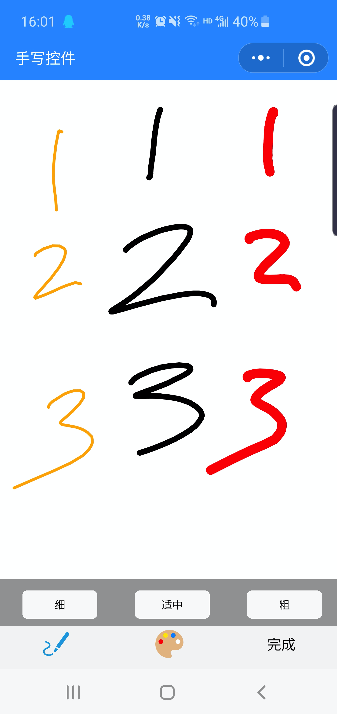
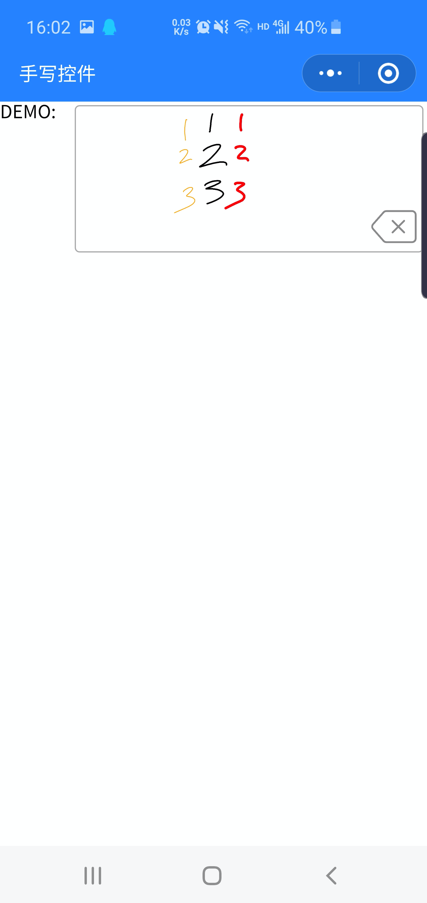

# 小程序插件-手写签名

[小程序组件github地址](https://github.com/AFAP/XCX-Plugins)

## 使用方法：

## 1.声明组件
下载代码，将components文件夹拷贝至项目根目录（与app.json平级），在`app.json`中声明需要使用的插件，这里的声明是全局的，pages下的页面都能直接用，也可以在某一个page对应的json文件中单独声明。

```
{
  "pages": [
    "pages/demo/handwriting"
  ],
  "window": {
    "backgroundTextStyle": "light",
    "navigationBarBackgroundColor": "#fff",
    "navigationBarTitleText": "WeChat",
    "navigationBarTextStyle": "black"
  },
  "usingComponents": {
    "handwriting": "/components/handwriting/index"
  },
  "sitemapLocation": "sitemap.json"
}
```
 *组件的名字可以自定义，如handwriting可以改成handwriting666，页面内使用时保持一致即可。

## 2.使用组件
最简单的方式：
```
<handwriting />
```
带有一些默认设置的方式
```
<handwriting bindOnComplete="onHnadwritingComplete" />
```
## 3.可设置属性
* 暂无

## 4.监听事件


事件名称 | 说明  
:-: | :- 
bindOnComplete | 点击完成时触发：<br/>event.detail为绘制得到的图片临时存储路径

**示例图片：**

设置颜色：


设置笔头粗细：


控件显示效果：

