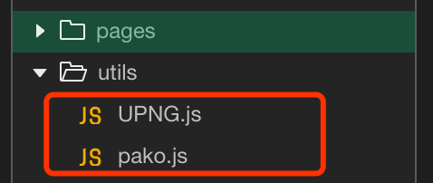

# 小程序整个页面添加水印，防止截图

某些情况下，为防止用户将单位内部数据截图分享导致信息泄露，会在app全局增加一个水印浮层，这样即使被截图或者被拍照，也能轻易查清泄露源头。同样的，在小程序上也可以实现类似效果。先看下实现效果：


水印的内容必须是动态的，与用户信息相关，水印需要覆盖整个页面，且不能影响用户的正常操作，简要实现思路：

- 1.以用户登录账户名为水印内容；
- 2.利用canvas绘制水印内容，并全局保存图片base64信息；
- 3.利用background的repeat性质，实现全局重复显示水印。

## 关键代码s：

需要使用到的第三方库（用于保存imageData）：[https://github.com/photopea/UPNG.js](https://github.com/photopea/UPNG.js)

放置目录如图：



`index.wxml`
```html
<view style='padding: 10px;'>
  <view wx:for="[1,2,3,4,5,6,7,8]" style="margin: 4px 0px;">这里测试内容--😁--O(∩_∩)O哈哈~</view>
</view>

<!-- 这里是用于初次绘制水印图片内容，以便获取并保存 -->
<view style='display: {{canvasShow}};'>
  <canvas style="width: 66px; height: 66px;" canvas-id="waterMarkCanvas"></canvas>
</view>

<view class="watermark" style='background-image: url({{backgroundImg}});'></view>
```

`index.wxss`
```css
.watermark {
  position: absolute;
  top: 0;
  width: 100%;
  height: 100%;
  background: #eeeeee11;
  pointer-events: none;
  background-repeat: repeat;
}
```

`index.js`
```js
var _this;
var app = getApp();
var upng = require('../../utils/UPNG.js')
Page({
  data: {
    canvasShow: ""
  },

  /**
   * 生命周期函数--监听页面加载
   */
  onLoad: function(options) {
    _this = this;
  },

  /**
   * 生命周期函数--监听页面初次渲染完成
   */
  onReady: function() {
    let username = wx.getStorageSync('username');
    // 获取画布
    const ctx = wx.createCanvasContext('waterMarkCanvas')
    // 设置倾斜角度
    ctx.rotate(0.8)
    // 设置水印字体字号
    ctx.setFontSize(17)
    // 设置色值，注意最后的透明度参数
    ctx.setFillStyle('rgba(188, 188, 188, 0.5)')
    // 绘制文字，注意左边和上面margin留一点，不然由于旋转会被遮挡
    ctx.fillText(username, 10, 10)
    ctx.draw();

    setTimeout(function() {
      console.log("延迟保存水印")
      wx.canvasGetImageData({
        canvasId: 'waterMarkCanvas',
        x: 0,
        y: 0,
        width: 90,
        height: 90,
        success(res) {
          let pngData = upng.encode([res.data.buffer], res.width, res.height)
          let base64 = wx.arrayBufferToBase64(pngData)
          // 将该图案保存在全剧终
          app.globalData.watermark = 'data:image/png;base64,' + base64;
          _this.setData({
            canvasShow: "none",
            backgroundImg: app.globalData.watermark
          });
        },
        fail(res) {
          console.log(res)
        }
      })
    }, 500)
  }
})
```

**以上代码的注释应该比较详细了，其中app.globalData.watermark用于全局存储这个图片对象，后续打开的其他页面，不需要再绘制获取图片了，直接赋值给background即可。* 

**canvasShow 用于控制初始绘制区域，使用完毕后隐藏即可。*
